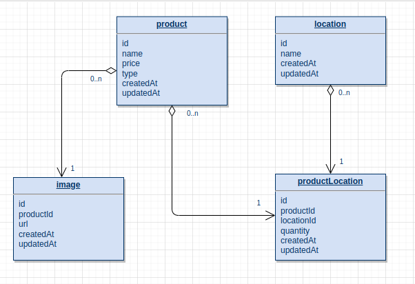

# Market Backend Service

This is a backend application for a product management system, built with NestJS, TypeORM, and PostgreSQL. It includes a RESTful API to manage products, locations, product availability across locations, and product images.

## Description

The project follows Clean Architecture principles, ensuring separation of concerns and modular design. It provides endpoints for CRUD operations on products and locations, handling product inventory across different locations, and managing product images.

### Dependencies

- Node.js (v14 or above)
- NestJS
- pnpm
- PostgreSQL
- Docker & Docker Compose (for containerization)

## Installation

- Clone the repository to your local machine.
- Ensure Docker is running on your system.
- Copy `.env.example` to `.env` and fill in your database and application configuration details.

```bash
$ pnpm install
```

## Running the app

- Run the application using Docker Compose:

```bash
$ docker-compose up -d
```

```bash
# development
$ pnpm run start

# watch mode
$ pnpm run start:dev

# production mode
$ pnpm run start:prod
```

## Test

```bash
# unit tests
$ pnpm run test

# e2e tests
$ pnpm run test:e2e

# test coverage
$ pnpm run test:cov
```

## API Documentation

Database schema:


## Architecture Overview

The project structure is as follows:

- `src/modules/`: Contains the application modules, each encapsulating the logic for different entities (Products, Locations, etc.).
- `src/entities/`: Contains TypeORM entities that represent tables in the PostgreSQL database.
- `src/migrations/`: Contains TypeORM migration files for database schema changes.
- `src/services/`: Contains business logic for handling operations on data.
- `src/controllers/`: Contains logic for handling HTTP requests and sending responses.

## Support

Nest is an MIT-licensed open source project. It can grow thanks to the sponsors and support by the amazing backers. If you'd like to join them, please [read more here](https://docs.nestjs.com/support).

## Authors

Lucas Alves Ferreira - Initial work
